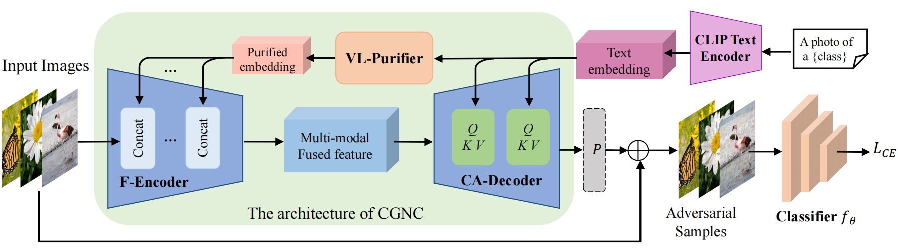
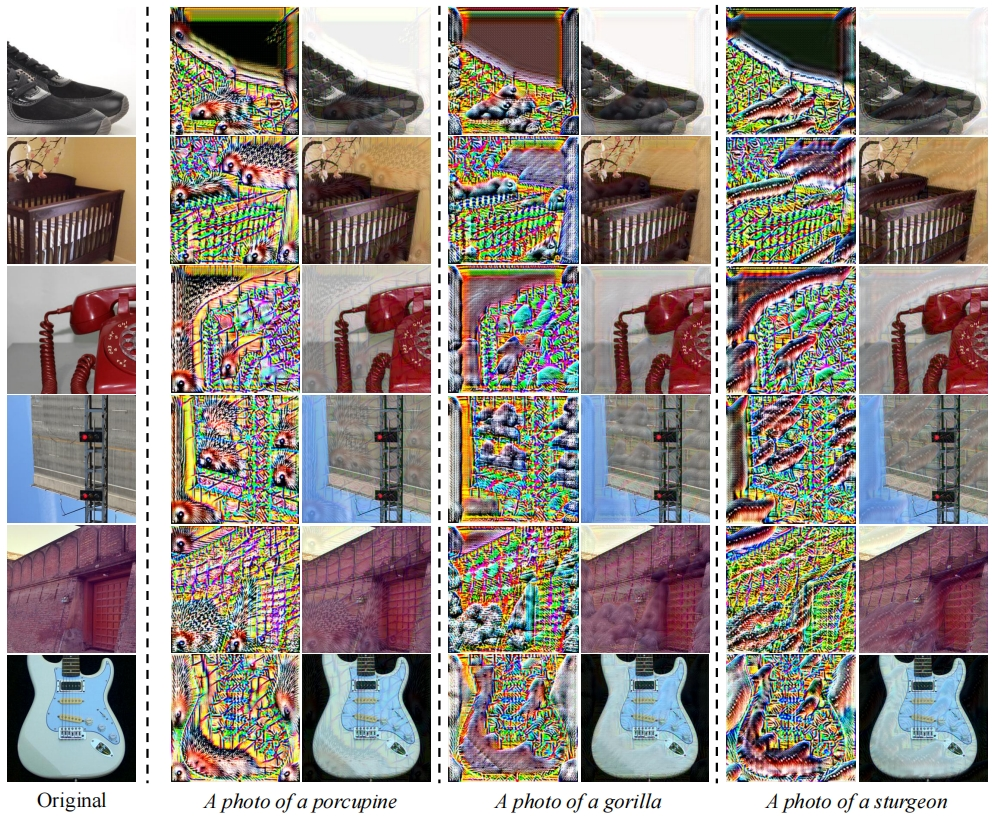

# CLIP-Guided Generative Networks for Transferable Targeted Adversarial Attacks
[ECCV-2024] A PyTorch official implementation for CLIP-Guided Generative Networks for Transferable Targeted Adversarial Attacks, accepted to ECCV-2024.

[Hao Fang*](https://scholar.google.cz/citations?user=12237G0AAAAJ&hl=zh-CN),
[Jiawei Kong*](https://scholar.google.cz/citations?user=enfcklIAAAAJ&hl=zh-CN), 
[Bin Chen#](https://github.com/BinChen2021),
[Tao Dai](https://csse.szu.edu.cn/pages/user/index?id=1204),
[Hao Wu](https://dblp.org/pid/72/4250.html),
[Shu-Tao Xia](https://www.sigs.tsinghua.edu.cn/xst/main.htm)



## Results
<!--  -->


## Setup
We provide the environment configuration file exported by Anaconda, which can help you build up conveniently.
```bash
conda env create -f environment.yml
conda activate CGNC
```  
## Running commands

### Training

- Download the [ImageNet](https://www.image-net.org/) training set. 

- Below we provide running commands for training the CLIP-guided generator based on 8 different target classes from a previous same setting.


```python
python train.py --train_dir $DATA_PATH/ImageNet/train --model_type incv3 --start_epoch 0 --epochs 10 --label_flag 'N8'
```

### Single-target Masked Finetuning
Below we provide running commands for finetuning the CLIP-guided generator based on one single class if necessary (take class id 150 as example).


```python
python train.py --train_dir $DATA_DIR/ImageNet/train --model_type incv3 --start_epoch 10 --epochs 15 --label_flag 'N8' --load_path $CKPT_DIR/incv3/model-9.pth --finetune --finetune_class 150
```

### Generating adversarial examples
Below we provide running commands for generating targeted adversarial examples on [ImageNet NeurIPS validation set](https://www.kaggle.com/c/nips-2017-non-targeted-adversarial-attack) (1k images) under our multi-class setting:
```python
python eval.py --data_dir data/ImageNet1k/ --model_type incv3 --load_path $SAVE_CHECKPOINT --save_dir ADV_DIR
```

Below we provide running commands for generating targeted adversarial examples on [ImageNet NeurIPS validation set](https://www.kaggle.com/c/nips-2017-non-targeted-adversarial-attack) (1k images) under our single-class setting (take class id 150 as example):
```python
python eval.py --data_dir data/ImageNet1k/ --model_type incv3 --load_path $SAVE_CHECKPOINT --save_dir $IMAGES_DIR --finetune --finetune_class 150
```

### Testing
The above crafted targeted adversarial examples can be directly used for testing different models in [torchvision](https://pytorch.org/vision/stable/models.html).

Below we provide running commands for testing our method against different black-box models: 
```python
python inference.py --test_dir $IMAGES_DIR --model_t vgg16
```
